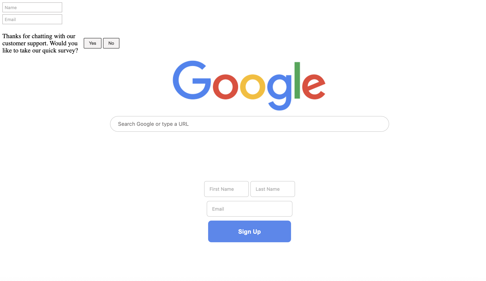

# HTML/CSS/ & JavaScript Projects

While teaching myself HTML, CSS, and JavaScript I thought it would be a good idea to keep a collection of mini front-end projects to showcase my growth and skills! Built with **HTML5**,**CSS3**,and **JavaScript** these projects explore UI design, styling, and responsiveness with clean code and interactive elements.

## 📂 Projects

- **Buttons** → Interactive button designs with hover and active effects.  
  

- **Display & Inline Blocks** → Practicing `block`, `inline`, and `inline-block` with inputs, buttons, and a Google-style search bar.  
  

- **Div Practice** → Shapes, satisfaction box, YouTube Music card, tweet box, and friend profile cards built with divs and CSS styling.  
  

- **Text Styling** → Experiments with fonts, line height, spacing, and UI elements like MacBook ads and coding site snippets.  
    
  

- **Google Search Clone** → A finished recreation of Google’s homepage design, with centered logo, pill-shaped search bar, and aligned buttons.  
  

- **Grid** → Practicing **CSS Grid** layouts using simple, colorful blocks. Each section demonstrates a different grid-template setup (fixed tracks, fractional units, and mixed widths).  
  

- **Flexbox** → Practicing **CSS Flexbox** layouts with colorful blocks to see how different elements change the positioning. It shows using fixed widths, flexible growth, element order, and alignment options like `justify-content` and `align-items` to make layouts more flexible and responsive.  
  

- **Position Practice** → Exploring **CSS positioning** (`fixed`, `absolute`, `relative`, `static`) with a sticky header, sidebar, and content boxes. This project shows how elements interact with `z-index` and positioning rules.  
  

- Cart Quantity Counter (JavaScript) → A simple interactive project that tracks items in a shopping cart. Using multiple buttons and a shared JavaScript variable, users can add quantities, reset the cart, and view updates directly in the console. This helped me understand variables, event handling, and template literals in JavaScript while connecting HTML elements with logic.

- Coin Flip Game (JavaScript) → A fun project where the user picks either “Heads” or “Tails” and the computer flips a virtual coin. Using Math.random() and a ternary operator, the game randomly decides the result and tells you if you won or lost. I learned how to use functions, conditionals, and template literals in JavaScript to make interactive buttons and show results on both the console and screen.

(More will be added as the collection grows!)

## 🛠️ Built With
- **HTML5** – Page structure  
- **CSS3** – Styling, hover states, and transitions
- **JavaScript** – Interactive logic and DOM manipulation
